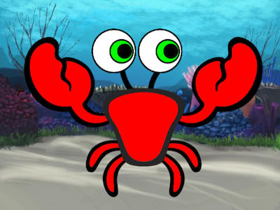
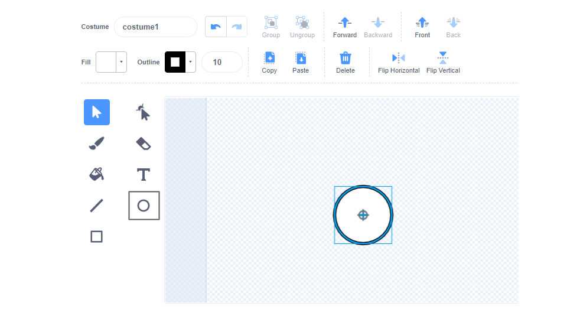
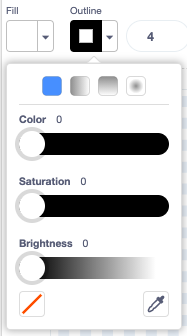
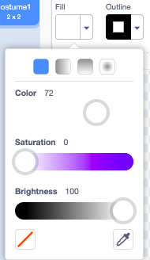
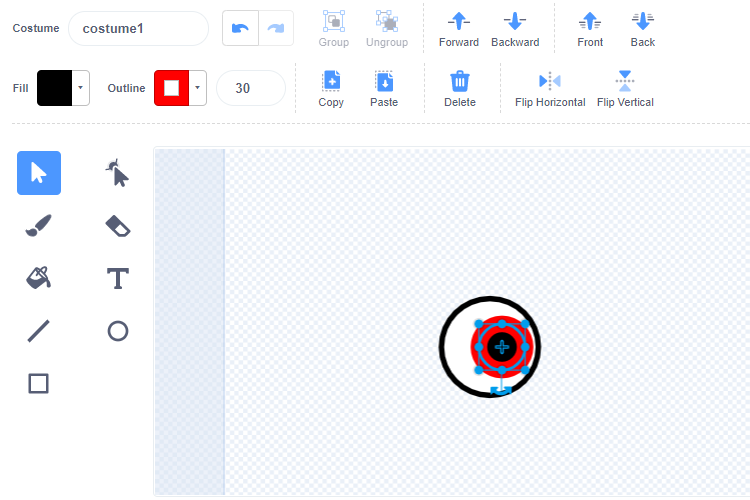

## Make googly eyes

<div style="display: flex; flex-wrap: wrap">
<div style="flex-basis: 200px; flex-grow: 1; margin-right: 15px;">
In this step, you will make the googly eyes! Each eye needs to be a separate sprite so that it can move separately.
</div>
<div>

{:width="300px"}  
</div>
</div>

--- task ---

Add a new **sprite** using the **Paint** option. 


The Paint editor will open, for you to paint your **Eyeball** sprite's costume.

--- /task ---

It is really important that:
- The costume has the black pupil and coloured iris facing to the right
- The **eyeball** costume is centred

--- task ---

**Choose:** Draw your eyeball **or** start from a round sprite.

--- collapse ---

---
title: Draw an eyeball in the Paint editor
---

Select the **Circle** tool.

To draw a perfect circle, press and hold the <kbd>Shift</kbd> key on the keyboard while you draw with the oval. If you are using a tablet, try to get as close to a perfect circle as possible.

We set the outline to black and the eyeball to white:



Use the **Fill** colour chooser to choose your colours. To make black, slide both the **Saturation** and **Brightness** to `0`. To make white, slide the **Saturation** to `0` and the **Brightness** to `100`.




Make sure that the eyeball is centred so the blue cross is inside the grey circle.

Draw a smaller perfect circle and position it on the right-hand side of the eyeball:



You could also draw circles inside circles, or make the eyeball coloured to get different effects.

--- /collapse ---


--- collapse ---

---
title: Turn a round costume into an eyeball
---

There are costumes in Scratch that can be edited to make googly eyes for your character. 

Use the Paint editor to change the costumes to add circles, and choose a different **Fill** colour or remove parts of the costume to turn it into a googly eye. 

**Tip:** The costume will need to be centred in the Paint editor using the crosshair so that it rotates smoothly as it turns. The black pupil and coloured iris need to be positioned to the right-hand side of the costume so that it follows the mouse pointer.


--- /collapse ---

--- /task ---

--- task ---

Name your sprite `Eyeball` in the Sprite pane.

--- /task ---

--- task ---

Drag the **Eyeball** sprite into the position that you want it on the Stage and change its size to fit your character.

--- /task ---

Now that you have an eyeball, make it look at the `mouse-pointer`{:class="block3motion"}.

--- task ---

Add a script to `set the rotation style`{:class="block3motion"} to `all around`{:class="block3motion"} to make the eyeball `point towards the mouse pointer`{:class="block3motion"} `forever`{:class="block3control"}. 

--- collapse ---

---
title: Make a sprite point towards the mouse pointer
---

```blocks3
when flag clicked
set rotation style [all around v]
forever
point towards (mouse-pointer v)
end
```

--- /collapse ---

--- /task ---


If your character is a cyclops, then you are done. 

--- task ---

Otherwise, right-click (or on a tablet, tap and hold) on the **Eyeball** sprite in the Sprite list and choose **duplicate** to create more eyes.

[[[scratch3-duplicate-sprite]]]

--- /task ---

--- task ---

**Test:** Click on the green flag and try your project out. Do the googly eyes follow you as you move the mouse around?

**Tip:** You don't have to keep the mouse pointer on the Stage. The eyes will follow you as you carry on coding in Scratch.

--- /task ---

--- task ---
**Debug:** You might find some bugs in your project that you need to fix. Here are some common bugs.

--- collapse ---
--- 
title: The eyes do not move
---

Make sure that you have added the code to the **eye** sprite(s) and **clicked on the green flag**. Your code will not run until you click on the green flag.

--- /collapse ---

--- collapse ---
--- 
title: The eyes point away from the mouse
---

Check that the pupil is on the right-hand side (past the blue cross in the middle) in the **eye** costume(s). 

The eyeball has the `all around`{:class="block3motion"} `rotation style`{:class="block3motion"} so it can rotate in any direction. 

When the eyeball rotates to `point towards`{:class="block3motion"} the `mouse pointer`{:class="block3motion"}, the pupil will be closest to the mouse pointer. 


--- /collapse ---

--- collapse ---
--- 
title: The eyes jump around the Stage
---

Check that the costume is centred. Drag the costume so that the blue cross lines up with the grey cross in the Paint editor.


--- /collapse ---

--- collapse ---

--- 
title: The character is in front of the eyes
---

When you drag a sprite to position it on the Stage, it moves in front of the other sprites. 

To get your character sprite to stay at the back, use:

```blocks3
when green flag clicked
forever
go to [back v] layer // behind all other sprites
```

--- /collapse ---

--- collapse ---

---
title: The character and the eyes follow the mouse pointer
---

Did you add the eyes as costumes to your character instead of as costumes on separate sprites? You can fix that. 

One way to fix it is to duplicate the **character** sprite and then rename the copy as `Eyeball`. Then, delete the **eye** costumes from the **character**, and the **character** costumes from the **eye**. Then, you can duplicate the **Eyeball** sprite and name it `Eyeball 2`.

The code to `point towards`{:class="block3motion"} the `mouse-pointer`{:class="block3motion"} should be on the **Eyeball** sprites and not the **character** sprite.

--- /collapse ---

--- collapse ---

---
title: The character follows the mouse pointer (and the eyes do not)
---

You need to add the `point towards`{:class="block3motion"} code to the individual **Eyeball** sprites, not your **character** sprite!

You can drag the code from the Code area of your **character** to the **Eyeball** sprite(s) in the Sprite list to copy it. 

You will also need to delete the script from the **character** sprite by dragging it to the Blocks menu.

--- /collapse ---

You might find a bug that is not listed here. Can you figure out how to fix it? 

We love hearing about your bugs and how you fixed them. Use the feedback button at the bottom of this page if you found a different bug in your project. 


--- /task ---

--- save ---
