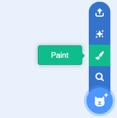
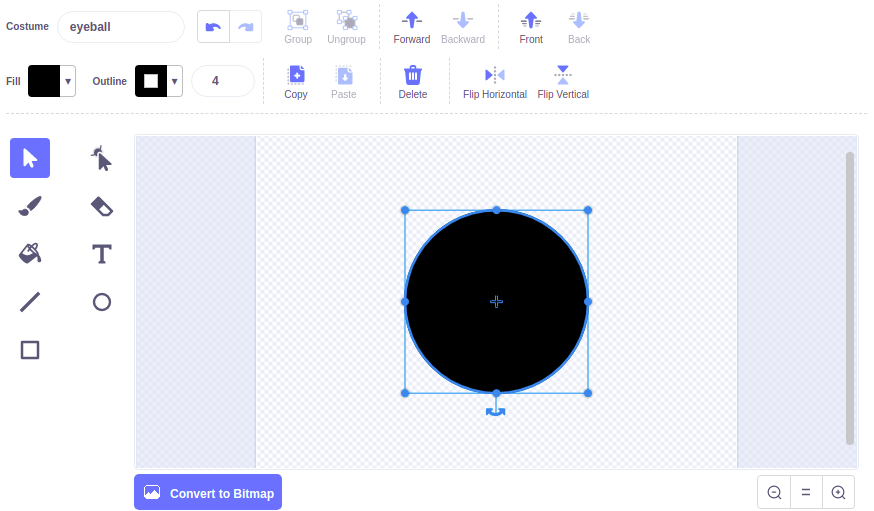
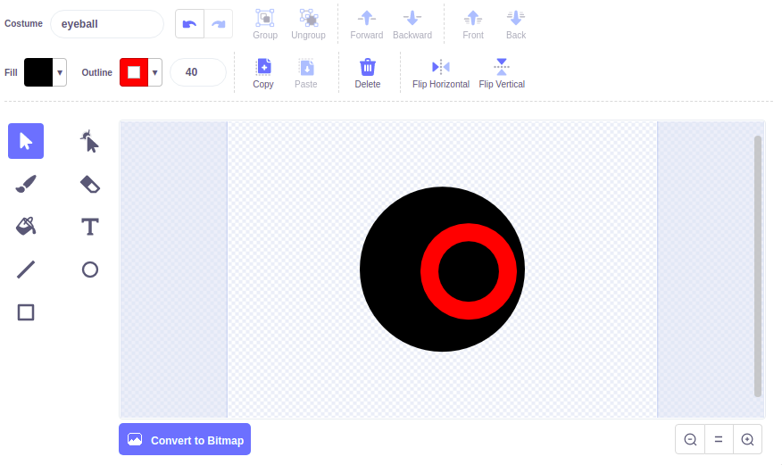
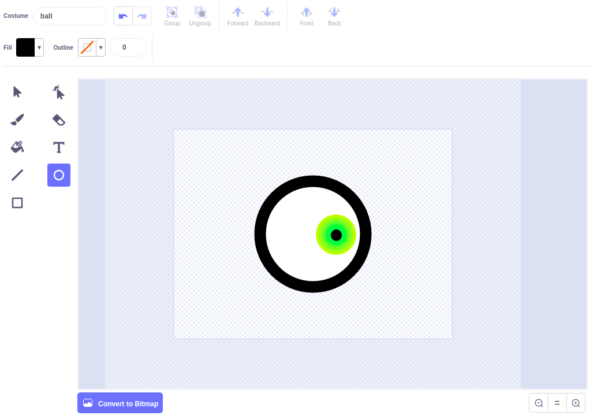
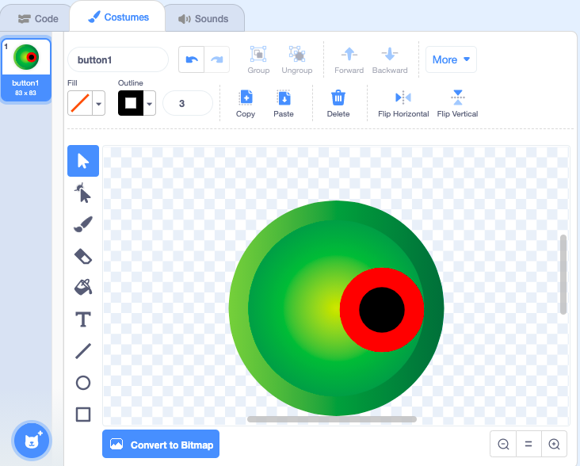
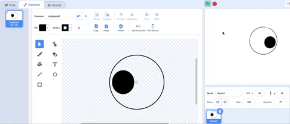
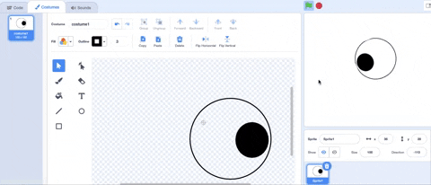

## Make googly eyes

<div style="display: flex; flex-wrap: wrap">
<div style="flex-basis: 200px; flex-grow: 1; margin-right: 15px;">
In this step, make the googly eyes! Each eye needs to be a separate sprite so it can move separately.
</div>
<div>

{:width="300px"}  
</div>
</div>

--- task ---

Add a new **sprite** using the Paint option. 



The Paint editor will open for you to paint your Eyeball sprite's costume.

--- /task ---

It's really important that:
- the costume has the black pupil and coloured iris facing to the right
- the eyeball costume is centered

--- task ---

**Choose:** draw your eyeball **or** start from a round sprite.

--- collapse ---

---
title: Draw an eyeball in the Paint editor
---

Select the oval tool.

You need to draw a perfect circle otherwise the whole eyeball will wobble around (instead of it being a Googly eye). 

To draw a perfect circle, press and hold the `Shift` key on the keyboard while you draw with the oval. If you are on a tablet, try and get as close to a perfect circle as possible.

This is the outline of the eyeball so in the example we made it black. Make sure the circle is in the centre.



Draw a smaller perfect circle and position it in the first circle.

You can either change the outline colour and thickness and make the outline the iris:



Or, you can change the colour of your second circle and draw a third perfect circle as the pupil:



--- /collapse ---


--- collapse ---

---
title: Turn a round costume into an eyeball
---

There are costumes in Scratch that can be edited to make googly eyes for your character. Examples of these are 'Ball' and 'Button1' though there are many others you can choose.

Use the Paint editor to change the costumes to add circles, and choose a different fill colour or remove parts of the costume to turn it into a googly eye. 

**Tip**: The costume will need to be centered in the Paint editor using the crosshair so that it rotates smoothly as it turns. The black pupil and coloured iris need to be positioned to the right side of the costume so that it follows the mouse pointer.




--- /collapse ---

--- /task ---

--- task ---

Name your sprite 'Eyeball' in the Sprite pane.

--- /task ---

Now you have an eyeball, make it look at the `mouse-pointer`{:class="block3motion"}.

--- task ---

Add a script to `set the rotation style`{:class="block3motion"} to `all around`{:class="block3motion"} to make the eyeball `point towards the mouse pointer`{:class="block3motion"} `forever`{:class="block3control"}. 

--- collapse ---

---
title: Make a sprite point towards the mouse pointer
---

```blocks3
when flag clicked
set rotation style [all around v]
forever
point towards (mouse-pointer v)
end
```

--- /collapse ---

--- /task ---

--- task ---

Drag the Eyeball sprite into the position you want it on the Stage and change its size to fit your character.

--- /task ---

If your character is a cyclops then you are done. 

--- task ---

Otherwise, right-click (or tap and hold on a tablet) on the Eyeball sprite in the Sprite list and choose 'duplicate' to create more eyes.

[[[scratch3-duplicate-sprite]]]

--- /task ---

--- task ---

**Test:** Click the green flag and try your project out, do the googly eyes follow you as you move the mouse around?

**Tip:** You don't have to keep the mouse pointer on the Stage. The eyes will follow you as you carry on coding in Scratch.

--- /task ---

--- task ---
**Debug:** 

--- collapse ---
--- 
title: The eyes don't move
---

Make sure you have added the code to the eye sprite(s) and **clicked the green flag**. Your code won't run until you click the green flag.

--- /collapse ---

--- collapse ---
--- 
title: The eyes point away from the mouse
---

Check that the pupil is on the right (past the blue cross in the middle) in the eye costume(s). 

The eyeball has the `all around`{:class="block3motion"} `rotation style`{:class="block3motion"} so it can rotate in any direction. 

When the eyeball rotates to `point towards`{:class="block3motion"} the `mouse pointer`{:class="block3motion"}, the pupil will be closest to the mouse pointer. 




--- /collapse ---

--- collapse ---
--- 
title: The eyes jump around the Stage
---

Check that the costume is centered. Drag the costume so that the blue cross lines up with the grey cross in the Paint editor.




--- /collapse ---

--- collapse ---

--- 
title: The character is in front of the eyes
---

When you drag a sprite to position it on the Stage it moves in front of the other sprites. 

To get your character sprite to stay at the back use:

```blocks3
when green flag clicked
forever
go to [back v] layer // behind all other sprites
```

--- /collapse ---

--- collapse ---

---
title: The character and the eyes follow the mouse pointer
---

Did you add the eyes as costumes to your character instead of as costumes on separate sprites? Don't worry you can fix that. 

One way to fix it is to duplicate the character sprite and then rename the copy as Eyeball. Then delete the eye costumes from the character, and the character costumes from the eye. Then you can duplicate the Eyeball sprite and name it 'Eyeball 2'.

The code to `point towards`{:class="block3motion"} the `mouse-pointer`{:class="block3motion"} should be on the Eyeball sprites and not the character sprite.

--- /collapse ---

--- collapse ---

---
title: The character follows the mouse pointer (and the eyes don't)
---

You need to add the `point towards`{:class="block3motion"} code to the individual Eyeball sprites, not your character sprite!

You can drag the code from the Code area of you character to the eyeball sprite(s) in the Sprite list to copy it. 

You will also need to delete the script from the character sprite by dragging it to the Blocks menu.

--- /collapse ---

--- /task ---

--- save ---
